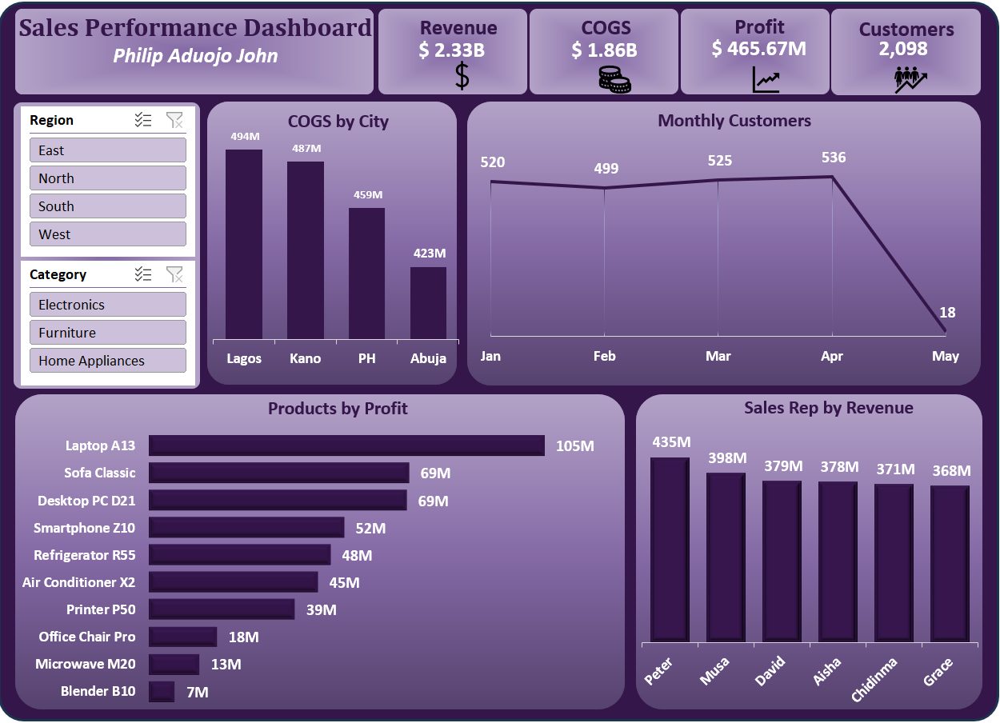

# Sales Performance Dashboard - 
Interactive Excel Data Analytics Project

**An executive-level sales performance dashboard designed to analyze high-level financial metrics, customer trends, regional cost distribution, product profitability, and sales representative performance.**

## Project Preview

## Project Overview

This project transforms raw transactional data into an interactive Excel dashboard that evaluates sales revenue, profitability, and customer acquisition across key regions. Users can dynamically filter data by product category and region to uncover revenue drivers, high-margin products, and top-performing sales representatives.

## From Data to Dashboard

The project started with a structured dataset, followed by data preparation, analysis, dashboard planning, and final visualization in Excel.

### Source Data

[Source Data](data.xlsx)

## Dashboard Features

- Interactive slicers
- Dynamic KPI cards
- Regional cost distribution
- Customer trend analysis
- Product performance comparison
- Clean dashboard layout
- Sale rep performance tracking

## Files Included

| File | Description |
|---|---|
| `excel-dashboard.xlsx` | Completed Excel dashboard |
| `dashboard-image.png` | Preview of the final dashboard |
| `data.xlsx` | Preview of the source data |
| `README.md` | Project documentation |

## How to Download and Use

1. Download `excel-dashboard.xlsx`.
2. Open the workbook using Microsoft Excel.
3. Navigate to the dashboard worksheet.
4. Use the available filters and slicers to explore the results.

[Download the Excel Dashboard](excel-dashboard.xlsx)

## Tools and Skills

- Microsoft Excel
- Excel formulas
- PivotTables
- PivotCharts
- Slicers
- Data analysis
- Dashboard design
- Data visualization
